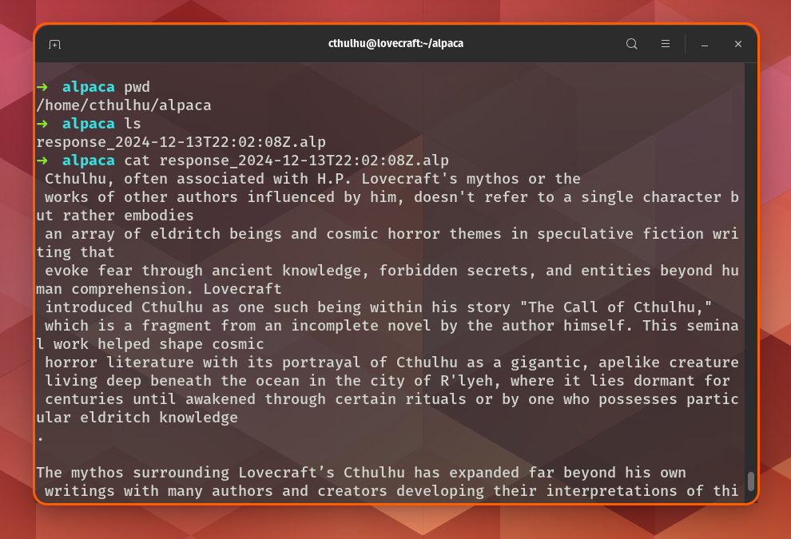

# Alpaca

Alpaca is a project of a serie (4th i think)  that belong my portfolio
This is a plugin for [pop-launcher](https://github.com/pop-os/launcher) that use the IPC to send an ask to your local llm running with ollama, am using the model [phi3:mini](https://ollama.com/library/phi3) cuz its relative fast, 

## Use
Remember first run you local ollama instance, may you can pull phi3:mini before run it.

```sh
ollama pull phi3:mini
```

To use follow the steps:

```sh
cd /home/$USER/.local/share/pop-launcher/plugins/
git clone https://github.com/JavierAcevedoC/alpaca 
make
```

### Example
To keep the sentences relative to words and not chars. you have to add a dot at the end of every sentence.

```sh 
ia what its cthulhu.
```
#### New



